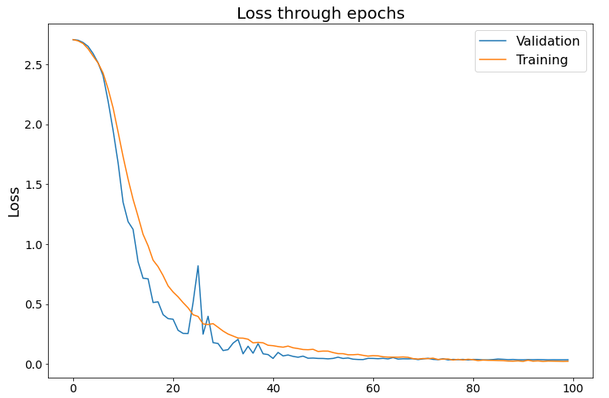
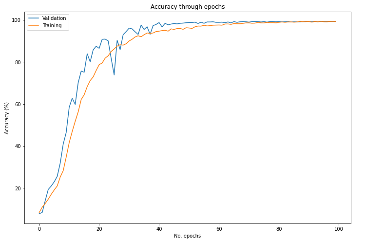
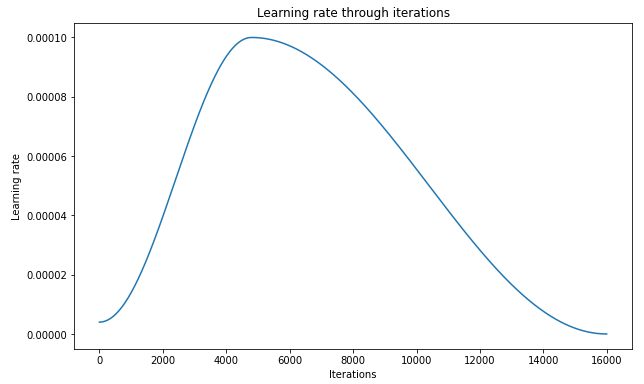
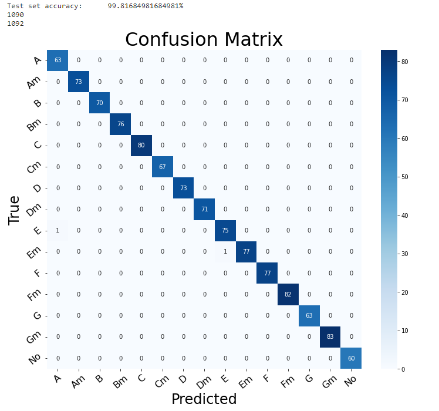

# Guitar chords classification with PyTorch

 
Used dataset: homemade images (5.000+)
 
 
Time of training (with validation phases) 1h 23m 45s.
 
 

 

 

 

Confusion matrix was created from the predictions on the TEST set
 
 
 

### Training details:
 

Total parameters: 			      8,910,671 
Total trainable parameters: 	8,910,671 
 
Training dataset size: 		5,092 
Validation dataset size: 	1,091 
Test dataset size: 			1,092 
 
Input image size: 	 256 × 256 
 
Batch size    	 32 
Learning rate 	 0.0001 
Loss function 	 <function cross_entropy at 0x7fdea31dd680> 
No. epochs    	 100 
 
 
 
EPOCH: 1	Time:  0h  0m 49s 
Training	train accuracy 8.42%	train loss: 2.7048 
Validation	val accuracy   7.79%	val loss:   2.7045 
 
EPOCH: 2	Time:  0h  0m 48s 
Training	train accuracy 10.92%	train loss: 2.6946 
Validation	val accuracy   8.43%	val loss:   2.7000 
 
EPOCH: 3	Time:  0h  0m 49s 
Training	train accuracy 12.69%	train loss: 2.6724 
Validation	val accuracy   14.02%	val loss:   2.6806 
 
EPOCH: 4	Time:  0h  0m 48s 
Training	train accuracy 14.69%	train loss: 2.6283 
Validation	val accuracy   19.34%	val loss:   2.6484 
 
EPOCH: 5	Time:  0h  0m 49s 
Training	train accuracy 17.05%	train loss: 2.5676 
Validation	val accuracy   20.99%	val loss:   2.5885 
 
EPOCH: 6	Time:  0h  0m 48s 
Training	train accuracy 19.11%	train loss: 2.5098 
Validation	val accuracy   23.01%	val loss:   2.5114 
 
EPOCH: 7	Time:  0h  0m 49s 
Training	train accuracy 21.01%	train loss: 2.4261 
Validation	val accuracy   25.57%	val loss:   2.4036 
 
EPOCH: 8	Time:  0h  0m 49s 
Training	train accuracy 25.26%	train loss: 2.2946 
Validation	val accuracy   31.90%	val loss:   2.1926 
 
EPOCH: 9	Time:  0h  0m 49s 
Training	train accuracy 28.30%	train loss: 2.1360 
Validation	val accuracy   40.97%	val loss:   1.9493 
 
EPOCH: 10	Time:  0h  0m 49s 
Training	train accuracy 34.76%	train loss: 1.9345 
Validation	val accuracy   46.47%	val loss:   1.6774 
 
EPOCH: 11	Time:  0h  0m 49s 
Training	train accuracy 41.65%	train loss: 1.7294 
Validation	val accuracy   58.48%	val loss:   1.3483 
 
EPOCH: 12	Time:  0h  0m 49s 
Training	train accuracy 46.92%	train loss: 1.5414 
Validation	val accuracy   62.79%	val loss:   1.1868 
 
EPOCH: 13	Time:  0h  0m 49s 
Training	train accuracy 51.77%	train loss: 1.3734 
Validation	val accuracy   59.85%	val loss:   1.1222 
 
EPOCH: 14	Time:  0h  0m 49s 
Training	train accuracy 56.28%	train loss: 1.2301 
Validation	val accuracy   70.21%	val loss:   0.8524 
 
EPOCH: 15	Time:  0h  0m 49s 
Training	train accuracy 62.16%	train loss: 1.0809 
Validation	val accuracy   75.71%	val loss:   0.7147 
 
EPOCH: 16	Time:  0h  0m 49s 
Training	train accuracy 64.41%	train loss: 0.9859 
Validation	val accuracy   75.16%	val loss:   0.7100 
 
EPOCH: 17	Time:  0h  0m 48s 
Training	train accuracy 68.28%	train loss: 0.8657 
Validation	val accuracy   83.96%	val loss:   0.5122 
 
EPOCH: 18	Time:  0h  0m 49s 
Training	train accuracy 71.17%	train loss: 0.8114 
Validation	val accuracy   80.11%	val loss:   0.5180 
 
EPOCH: 19	Time:  0h  0m 49s 
Training	train accuracy 72.94%	train loss: 0.7373 
Validation	val accuracy   85.79%	val loss:   0.4112 
 
EPOCH: 20	Time:  0h  0m 49s 
Training	train accuracy 75.98%	train loss: 0.6513 
Validation	val accuracy   87.53%	val loss:   0.3782 
 
EPOCH: 21	Time:  0h  0m 49s 
Training	train accuracy 78.77%	train loss: 0.6002 
Validation	val accuracy   86.53%	val loss:   0.3729 
 
EPOCH: 22	Time:  0h  0m 49s 
Training	train accuracy 79.54%	train loss: 0.5597 
Validation	val accuracy   90.83%	val loss:   0.2807 
 
EPOCH: 23	Time:  0h  0m 49s 
Training	train accuracy 81.87%	train loss: 0.5115 
Validation	val accuracy   90.93%	val loss:   0.2549 
 
EPOCH: 24	Time:  0h  0m 49s 
Training	train accuracy 82.95%	train loss: 0.4680 
Validation	val accuracy   90.10%	val loss:   0.2540 
 
EPOCH: 25	Time:  0h  0m 49s 
Training	train accuracy 85.02%	train loss: 0.4106 
Validation	val accuracy   81.85%	val loss:   0.5116 
 
EPOCH: 26	Time:  0h  0m 48s 
Training	train accuracy 86.23%	train loss: 0.3960 
Validation	val accuracy   73.88%	val loss:   0.8186 
 
EPOCH: 27	Time:  0h  0m 49s 
Training	train accuracy 87.57%	train loss: 0.3337 
Validation	val accuracy   90.38%	val loss:   0.2484 
 
EPOCH: 28	Time:  0h  0m 49s 
Training	train accuracy 88.24%	train loss: 0.3286 
Validation	val accuracy   85.88%	val loss:   0.3976 
 
EPOCH: 29	Time:  0h  0m 48s 
Training	train accuracy 88.04%	train loss: 0.3361 
Validation	val accuracy   93.03%	val loss:   0.1776 
 
EPOCH: 30	Time:  0h  0m 49s 
Training	train accuracy 88.71%	train loss: 0.3058 
Validation	val accuracy   94.50%	val loss:   0.1707 
 
EPOCH: 31	Time:  0h  0m 49s 
Training	train accuracy 90.02%	train loss: 0.2744 
Validation	val accuracy   96.15%	val loss:   0.1116 
 
EPOCH: 32	Time:  0h  0m 49s 
Training	train accuracy 90.85%	train loss: 0.2496 
Validation	val accuracy   95.78%	val loss:   0.1195 
 
EPOCH: 33	Time:  0h  0m 48s 
Training	train accuracy 91.95%	train loss: 0.2327 
Validation	val accuracy   94.41%	val loss:   0.1733 
 
EPOCH: 34	Time:  0h  0m 49s 
Training	train accuracy 92.52%	train loss: 0.2161 
Validation	val accuracy   93.13%	val loss:   0.2052 
 
EPOCH: 35	Time:  0h  0m 49s 
Training	train accuracy 92.05%	train loss: 0.2150 
Validation	val accuracy   97.62%	val loss:   0.0845 
 
EPOCH: 36	Time:  0h  0m 48s 
Training	train accuracy 93.01%	train loss: 0.2061 
Validation	val accuracy   95.51%	val loss:   0.1480 
 
EPOCH: 37	Time:  0h  0m 49s 
Training	train accuracy 93.83%	train loss: 0.1759 
Validation	val accuracy   96.79%	val loss:   0.0895 
 
EPOCH: 38	Time:  0h  0m 48s 
Training	train accuracy 93.64%	train loss: 0.1801 
Validation	val accuracy   93.22%	val loss:   0.1694 
 
EPOCH: 39	Time:  0h  0m 49s 
Training	train accuracy 93.83%	train loss: 0.1763 
Validation	val accuracy   97.34%	val loss:   0.0845 
 
EPOCH: 40	Time:  0h  0m 49s 
Training	train accuracy 94.52%	train loss: 0.1558 
Validation	val accuracy   97.89%	val loss:   0.0781 
 
EPOCH: 41	Time:  0h  0m 50s 
Training	train accuracy 94.70%	train loss: 0.1522 
Validation	val accuracy   98.81%	val loss:   0.0460 
 
EPOCH: 42	Time:  0h  0m 53s 
Training	train accuracy 94.97%	train loss: 0.1451 
Validation	val accuracy   96.70%	val loss:   0.0961 
 
EPOCH: 43	Time:  0h  0m 51s 
Training	train accuracy 95.15%	train loss: 0.1398 
Validation	val accuracy   98.44%	val loss:   0.0670 
 
EPOCH: 44	Time:  0h  0m 50s 
Training	train accuracy 94.70%	train loss: 0.1488 
Validation	val accuracy   97.71%	val loss:   0.0748 
 
EPOCH: 45	Time:  0h  0m 50s 
Training	train accuracy 95.78%	train loss: 0.1348 
Validation	val accuracy   98.08%	val loss:   0.0631 
 
EPOCH: 46	Time:  0h  0m 49s 
Training	train accuracy 95.54%	train loss: 0.1282 
Validation	val accuracy   98.35%	val loss:   0.0560 
 
EPOCH: 47	Time:  0h  0m 50s 
Training	train accuracy 95.93%	train loss: 0.1203 
Validation	val accuracy   98.17%	val loss:   0.0651 
 
EPOCH: 48	Time:  0h  0m 49s 
Training	train accuracy 95.99%	train loss: 0.1187 
Validation	val accuracy   98.44%	val loss:   0.0477 
 
EPOCH: 49	Time:  0h  0m 50s 
Training	train accuracy 95.56%	train loss: 0.1222 
Validation	val accuracy   98.53%	val loss:   0.0491 
 
EPOCH: 50	Time:  0h  0m 49s 
Training	train accuracy 96.33%	train loss: 0.1040 
Validation	val accuracy   98.72%	val loss:   0.0460 
 
EPOCH: 51	Time:  0h  0m 49s 
Training	train accuracy 96.21%	train loss: 0.1073 
Validation	val accuracy   98.81%	val loss:   0.0456 
 
EPOCH: 52	Time:  0h  0m 49s 
Training	train accuracy 95.99%	train loss: 0.1070 
Validation	val accuracy   98.81%	val loss:   0.0426 
 
EPOCH: 53	Time:  0h  0m 49s 
Training	train accuracy 96.78%	train loss: 0.0949 
Validation	val accuracy   98.99%	val loss:   0.0461 
 
EPOCH: 54	Time:  0h  0m 49s 
Training	train accuracy 97.13%	train loss: 0.0861 
Validation	val accuracy   98.35%	val loss:   0.0564 
 
EPOCH: 55	Time:  0h  0m 49s 
Training	train accuracy 97.09%	train loss: 0.0856 
Validation	val accuracy   98.99%	val loss:   0.0458 
 
EPOCH: 56	Time:  0h  0m 50s 
Training	train accuracy 97.51%	train loss: 0.0767 
Validation	val accuracy   98.44%	val loss:   0.0497 
 
EPOCH: 57	Time:  0h  0m 50s 
Training	train accuracy 97.19%	train loss: 0.0768 
Validation	val accuracy   99.08%	val loss:   0.0398 
 
EPOCH: 58	Time:  0h  0m 49s 
Training	train accuracy 97.33%	train loss: 0.0797 
Validation	val accuracy   99.08%	val loss:   0.0372 
 
EPOCH: 59	Time:  0h  0m 49s 
Training	train accuracy 97.53%	train loss: 0.0718 
Validation	val accuracy   99.18%	val loss:   0.0365 
 
EPOCH: 60	Time:  0h  0m 49s 
Training	train accuracy 97.58%	train loss: 0.0654 
Validation	val accuracy   98.90%	val loss:   0.0466 
 
EPOCH: 61	Time:  0h  0m 49s 
Training	train accuracy 97.62%	train loss: 0.0691 
Validation	val accuracy   98.90%	val loss:   0.0460 
 
EPOCH: 62	Time:  0h  0m 50s 
Training	train accuracy 97.55%	train loss: 0.0675 
Validation	val accuracy   98.99%	val loss:   0.0438 
 
EPOCH: 63	Time:  0h  0m 49s 
Training	train accuracy 98.10%	train loss: 0.0598 
Validation	val accuracy   98.72%	val loss:   0.0467 
 
EPOCH: 64	Time:  0h  0m 50s 
Training	train accuracy 98.13%	train loss: 0.0569 
Validation	val accuracy   99.08%	val loss:   0.0420 
 
EPOCH: 65	Time:  0h  0m 49s 
Training	train accuracy 97.92%	train loss: 0.0565 
Validation	val accuracy   98.63%	val loss:   0.0530 
 
EPOCH: 66	Time:  0h  0m 50s 
Training	train accuracy 98.33%	train loss: 0.0561 
Validation	val accuracy   99.27%	val loss:   0.0405 
 
EPOCH: 67	Time:  0h  0m 49s 
Training	train accuracy 98.25%	train loss: 0.0582 
Validation	val accuracy   98.90%	val loss:   0.0431 
 
EPOCH: 68	Time:  0h  0m 49s 
Training	train accuracy 98.23%	train loss: 0.0554 
Validation	val accuracy   99.18%	val loss:   0.0422 
 
EPOCH: 69	Time:  0h  0m 50s 
Training	train accuracy 98.41%	train loss: 0.0445 
Validation	val accuracy   99.27%	val loss:   0.0434 
 
EPOCH: 70	Time:  0h  0m 49s 
Training	train accuracy 98.64%	train loss: 0.0407 
Validation	val accuracy   99.18%	val loss:   0.0362 
 
EPOCH: 71	Time:  0h  0m 49s 
Training	train accuracy 98.64%	train loss: 0.0452 
Validation	val accuracy   98.99%	val loss:   0.0424 
 
EPOCH: 72	Time:  0h  0m 49s 
Training	train accuracy 98.47%	train loss: 0.0441 
Validation	val accuracy   99.27%	val loss:   0.0472 
 
EPOCH: 73	Time:  0h  0m 49s 
Training	train accuracy 98.53%	train loss: 0.0482 
Validation	val accuracy   99.27%	val loss:   0.0381 
 
EPOCH: 74	Time:  0h  0m 49s 
Training	train accuracy 98.90%	train loss: 0.0371 
Validation	val accuracy   99.27%	val loss:   0.0359 
 
EPOCH: 75	Time:  0h  0m 49s 
Training	train accuracy 98.64%	train loss: 0.0402 
Validation	val accuracy   99.08%	val loss:   0.0430 
 
EPOCH: 76	Time:  0h  0m 50s 
Training	train accuracy 98.63%	train loss: 0.0415 
Validation	val accuracy   99.27%	val loss:   0.0337 
 
EPOCH: 77	Time:  0h  0m 49s 
Training	train accuracy 98.88%	train loss: 0.0328 
Validation	val accuracy   98.99%	val loss:   0.0380 
 
EPOCH: 78	Time:  0h  0m 50s 
Training	train accuracy 98.76%	train loss: 0.0382 
Validation	val accuracy   99.27%	val loss:   0.0359 
 
EPOCH: 79	Time:  0h  0m 50s 
Training	train accuracy 98.76%	train loss: 0.0333 
Validation	val accuracy   99.27%	val loss:   0.0380 
 
EPOCH: 80	Time:  0h  0m 49s 
Training	train accuracy 98.66%	train loss: 0.0389 
Validation	val accuracy   99.18%	val loss:   0.0334 
 
EPOCH: 81	Time:  0h  0m 50s 
Training	train accuracy 98.90%	train loss: 0.0356 
Validation	val accuracy   99.27%	val loss:   0.0377 
 
EPOCH: 82	Time:  0h  0m 49s 
Training	train accuracy 99.08%	train loss: 0.0278 
Validation	val accuracy   99.18%	val loss:   0.0370 
 
EPOCH: 83	Time:  0h  0m 49s 
Training	train accuracy 98.92%	train loss: 0.0322 
Validation	val accuracy   99.18%	val loss:   0.0336 
 
EPOCH: 84	Time:  0h  0m 49s 
Training	train accuracy 99.08%	train loss: 0.0303 
Validation	val accuracy   99.36%	val loss:   0.0339 
 
EPOCH: 85	Time:  0h  0m 49s 
Training	train accuracy 99.12%	train loss: 0.0300 
Validation	val accuracy   99.08%	val loss:   0.0366 
 
EPOCH: 86	Time:  0h  0m 50s 
Training	train accuracy 98.98%	train loss: 0.0285 
Validation	val accuracy   99.18%	val loss:   0.0410 
 
EPOCH: 87	Time:  0h  0m 51s 
Training	train accuracy 99.08%	train loss: 0.0275 
Validation	val accuracy   99.18%	val loss:   0.0387 
 
EPOCH: 88	Time:  0h  0m 51s 
Training	train accuracy 99.39%	train loss: 0.0242 
Validation	val accuracy   99.18%	val loss:   0.0359 
 
EPOCH: 89	Time:  0h  0m 50s 
Training	train accuracy 99.19%	train loss: 0.0232 
Validation	val accuracy   99.27%	val loss:   0.0373 
 
EPOCH: 90	Time:  0h  0m 52s 
Training	train accuracy 99.23%	train loss: 0.0256 
Validation	val accuracy   99.36%	val loss:   0.0350 
 
EPOCH: 91	Time:  0h  0m 54s 
Training	train accuracy 99.29%	train loss: 0.0214 
Validation	val accuracy   99.27%	val loss:   0.0345 
 
EPOCH: 92	Time:  0h  0m 54s 
Training	train accuracy 99.00%	train loss: 0.0311 
Validation	val accuracy   99.36%	val loss:   0.0361 
 
EPOCH: 93	Time:  0h  0m 54s 
Training	train accuracy 99.31%	train loss: 0.0232 
Validation	val accuracy   99.36%	val loss:   0.0357 
 
EPOCH: 94	Time:  0h  0m 57s 
Training	train accuracy 99.14%	train loss: 0.0256 
Validation	val accuracy   99.27%	val loss:   0.0365 
 
EPOCH: 95	Time:  0h  0m 56s 
Training	train accuracy 99.41%	train loss: 0.0213 
Validation	val accuracy   99.36%	val loss:   0.0356 
 
EPOCH: 96	Time:  0h  0m 55s 
Training	train accuracy 99.18%	train loss: 0.0243 
Validation	val accuracy   99.36%	val loss:   0.0344 
 
EPOCH: 97	Time:  0h  0m 54s 
Training	train accuracy 99.16%	train loss: 0.0234 
Validation	val accuracy   99.36%	val loss:   0.0351 
 
EPOCH: 98	Time:  0h  0m 54s 
Training	train accuracy 99.31%	train loss: 0.0228 
Validation	val accuracy   99.36%	val loss:   0.0348 
 
EPOCH: 99	Time:  0h  0m 55s 
Training	train accuracy 99.35%	train loss: 0.0212 
Validation	val accuracy   99.36%	val loss:   0.0346 
 
EPOCH: 100	Time:  0h  0m 54s 
Training	train accuracy 99.25%	train loss: 0.0227 
Validation	val accuracy   99.36%	val loss:   0.0351 
 
 
 
TIME of training (with validation phases)  1h 23m 45s. 
